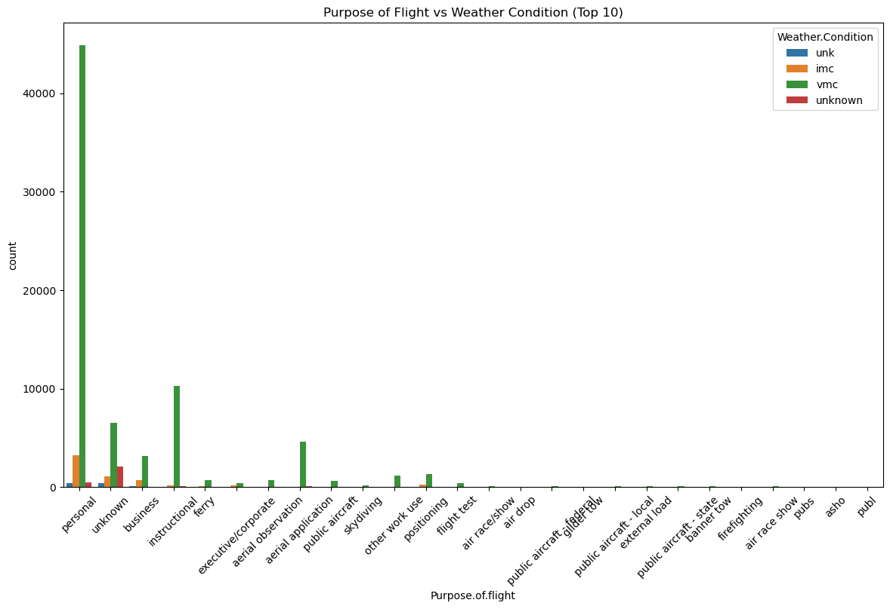

# Aircraft Risk Analysis For Aviation Industry

## Introduction

As the company plans to expand into the aviation industry, it is essential to make informed, data-driven decisions when selecting aircraft and planning operations. This project analyzes historical aviation accident data from the National Transportation Safety Board (NTSB), covering civil aviation accidents and incidents from 1962 to 2023.

The goal of this analysis is to identify lower-risk aircraft models and operational patterns using data cleaning, aggregation, and visualization. By carefully handling missing values and extracting key trends, we aim to uncover insights that will support sound business decision-making.


The final deliverable will include **three actionable business recommendations** based on data findings, enabling the company to approach this new venture with reduced risk and greater strategic clarity.

The procedure of the notebook
Data Overview

- Data Cleaning

- Exploratory Data Analysis (EDA)

- Insights and Visualizations

- Business Recommendations

- Conclusion


## Part 1: Interacting with Pandas DataFrames

In this project, we will work with aviation accident data collected by the National Transportation Safety Board (NTSB).

The dataset contains records of civil aviation accidents and selected incidents from 1962 to 2023, covering various features such as aircraft types, accident causes, locations, and outcomes. 
For additional information about the dataset, please refer to the [NTSB website](https://www.ntsb.gov/).


```python
# Always start by importing pandas
import pandas as pd
```

Read 'dataset_aviationData.csv' from the data foldeer into the notebook as a Pandas dataframe.


```python
df = pd.read_csv('data/AviationData.csv', encoding='ISO-8859-1', low_memory=False)
df

```


<div>
<style scoped>
    .dataframe tbody tr th:only-of-type {
        vertical-align: middle;
    }

    .dataframe tbody tr th {
        vertical-align: top;
    }

    .dataframe thead th {
        text-align: right;
    }
</style>
<table border="1" class="dataframe">
  <thead>
    <tr style="text-align: right;">
      <th></th>
      <th>Event.Id</th>
      <th>Investigation.Type</th>
      <th>Accident.Number</th>
      <th>Event.Date</th>
      <th>Location</th>
      <th>Country</th>
      <th>Latitude</th>
      <th>Longitude</th>
      <th>Airport.Code</th>
      <th>Airport.Name</th>
      <th>...</th>
      <th>Purpose.of.flight</th>
      <th>Air.carrier</th>
      <th>Total.Fatal.Injuries</th>
      <th>Total.Serious.Injuries</th>
      <th>Total.Minor.Injuries</th>
      <th>Total.Uninjured</th>
      <th>Weather.Condition</th>
      <th>Broad.phase.of.flight</th>
      <th>Report.Status</th>
      <th>Publication.Date</th>
    </tr>
  </thead>
  <tbody>
    <tr>
      <th>0</th>
      <td>20001218X45444</td>
      <td>Accident</td>
      <td>SEA87LA080</td>
      <td>1948-10-24</td>
      <td>MOOSE CREEK, ID</td>
      <td>United States</td>
      <td>NaN</td>
      <td>NaN</td>
      <td>NaN</td>
      <td>NaN</td>
      <td>...</td>
      <td>Personal</td>
      <td>NaN</td>
      <td>2.0</td>
      <td>0.0</td>
      <td>0.0</td>
      <td>0.0</td>
      <td>UNK</td>
      <td>Cruise</td>
      <td>Probable Cause</td>
      <td>NaN</td>
    </tr>
    <tr>
      <th>1</th>
      <td>20001218X45447</td>
      <td>Accident</td>
      <td>LAX94LA336</td>
      <td>1962-07-19</td>
      <td>BRIDGEPORT, CA</td>
      <td>United States</td>
      <td>NaN</td>
      <td>NaN</td>
      <td>NaN</td>
      <td>NaN</td>
      <td>...</td>
      <td>Personal</td>
      <td>NaN</td>
      <td>4.0</td>
      <td>0.0</td>
      <td>0.0</td>
      <td>0.0</td>
      <td>UNK</td>
      <td>Unknown</td>
      <td>Probable Cause</td>
      <td>19-09-1996</td>
    </tr>
    <tr>
      <th>2</th>
      <td>20061025X01555</td>
      <td>Accident</td>
      <td>NYC07LA005</td>
      <td>1974-08-30</td>
      <td>Saltville, VA</td>
      <td>United States</td>
      <td>36.922223</td>
      <td>-81.878056</td>
      <td>NaN</td>
      <td>NaN</td>
      <td>...</td>
      <td>Personal</td>
      <td>NaN</td>
      <td>3.0</td>
      <td>NaN</td>
      <td>NaN</td>
      <td>NaN</td>
      <td>IMC</td>
      <td>Cruise</td>
      <td>Probable Cause</td>
      <td>26-02-2007</td>
    </tr>
    <tr>
      <th>3</th>
      <td>20001218X45448</td>
      <td>Accident</td>
      <td>LAX96LA321</td>
      <td>1977-06-19</td>
      <td>EUREKA, CA</td>
      <td>United States</td>
      <td>NaN</td>
      <td>NaN</td>
      <td>NaN</td>
      <td>NaN</td>
      <td>...</td>
      <td>Personal</td>
      <td>NaN</td>
      <td>2.0</td>
      <td>0.0</td>
      <td>0.0</td>
      <td>0.0</td>
      <td>IMC</td>
      <td>Cruise</td>
      <td>Probable Cause</td>
      <td>12-09-2000</td>
    </tr>
    <tr>
      <th>4</th>
      <td>20041105X01764</td>
      <td>Accident</td>
      <td>CHI79FA064</td>
      <td>1979-08-02</td>
      <td>Canton, OH</td>
      <td>United States</td>
      <td>NaN</td>
      <td>NaN</td>
      <td>NaN</td>
      <td>NaN</td>
      <td>...</td>
      <td>Personal</td>
      <td>NaN</td>
      <td>1.0</td>
      <td>2.0</td>
      <td>NaN</td>
      <td>0.0</td>
      <td>VMC</td>
      <td>Approach</td>
      <td>Probable Cause</td>
      <td>16-04-1980</td>
    </tr>
    <tr>
      <th>...</th>
      <td>...</td>
      <td>...</td>
      <td>...</td>
      <td>...</td>
      <td>...</td>
      <td>...</td>
      <td>...</td>
      <td>...</td>
      <td>...</td>
      <td>...</td>
      <td>...</td>
      <td>...</td>
      <td>...</td>
      <td>...</td>
      <td>...</td>
      <td>...</td>
      <td>...</td>
      <td>...</td>
      <td>...</td>
      <td>...</td>
      <td>...</td>
    </tr>
    <tr>
      <th>88884</th>
      <td>20221227106491</td>
      <td>Accident</td>
      <td>ERA23LA093</td>
      <td>2022-12-26</td>
      <td>Annapolis, MD</td>
      <td>United States</td>
      <td>NaN</td>
      <td>NaN</td>
      <td>NaN</td>
      <td>NaN</td>
      <td>...</td>
      <td>Personal</td>
      <td>NaN</td>
      <td>0.0</td>
      <td>1.0</td>
      <td>0.0</td>
      <td>0.0</td>
      <td>NaN</td>
      <td>NaN</td>
      <td>NaN</td>
      <td>29-12-2022</td>
    </tr>
    <tr>
      <th>88885</th>
      <td>20221227106494</td>
      <td>Accident</td>
      <td>ERA23LA095</td>
      <td>2022-12-26</td>
      <td>Hampton, NH</td>
      <td>United States</td>
      <td>NaN</td>
      <td>NaN</td>
      <td>NaN</td>
      <td>NaN</td>
      <td>...</td>
      <td>NaN</td>
      <td>NaN</td>
      <td>0.0</td>
      <td>0.0</td>
      <td>0.0</td>
      <td>0.0</td>
      <td>NaN</td>
      <td>NaN</td>
      <td>NaN</td>
      <td>NaN</td>
    </tr>
    <tr>
      <th>88886</th>
      <td>20221227106497</td>
      <td>Accident</td>
      <td>WPR23LA075</td>
      <td>2022-12-26</td>
      <td>Payson, AZ</td>
      <td>United States</td>
      <td>341525N</td>
      <td>1112021W</td>
      <td>PAN</td>
      <td>PAYSON</td>
      <td>...</td>
      <td>Personal</td>
      <td>NaN</td>
      <td>0.0</td>
      <td>0.0</td>
      <td>0.0</td>
      <td>1.0</td>
      <td>VMC</td>
      <td>NaN</td>
      <td>NaN</td>
      <td>27-12-2022</td>
    </tr>
    <tr>
      <th>88887</th>
      <td>20221227106498</td>
      <td>Accident</td>
      <td>WPR23LA076</td>
      <td>2022-12-26</td>
      <td>Morgan, UT</td>
      <td>United States</td>
      <td>NaN</td>
      <td>NaN</td>
      <td>NaN</td>
      <td>NaN</td>
      <td>...</td>
      <td>Personal</td>
      <td>MC CESSNA 210N LLC</td>
      <td>0.0</td>
      <td>0.0</td>
      <td>0.0</td>
      <td>0.0</td>
      <td>NaN</td>
      <td>NaN</td>
      <td>NaN</td>
      <td>NaN</td>
    </tr>
    <tr>
      <th>88888</th>
      <td>20221230106513</td>
      <td>Accident</td>
      <td>ERA23LA097</td>
      <td>2022-12-29</td>
      <td>Athens, GA</td>
      <td>United States</td>
      <td>NaN</td>
      <td>NaN</td>
      <td>NaN</td>
      <td>NaN</td>
      <td>...</td>
      <td>Personal</td>
      <td>NaN</td>
      <td>0.0</td>
      <td>1.0</td>
      <td>0.0</td>
      <td>1.0</td>
      <td>NaN</td>
      <td>NaN</td>
      <td>NaN</td>
      <td>30-12-2022</td>
    </tr>
  </tbody>
</table>
<p>88889 rows × 31 columns</p>
</div>


Looking at the first 5 rows and the last 10 rows


```python
df.head()

```


<div>
<style scoped>
    .dataframe tbody tr th:only-of-type {
        vertical-align: middle;
    }

    .dataframe tbody tr th {
        vertical-align: top;
    }

    .dataframe thead th {
        text-align: right;
    }
</style>
<table border="1" class="dataframe">
  <thead>
    <tr style="text-align: right;">
      <th></th>
      <th>Event.Id</th>
      <th>Investigation.Type</th>
      <th>Accident.Number</th>
      <th>Event.Date</th>
      <th>Location</th>
      <th>Country</th>
      <th>Latitude</th>
      <th>Longitude</th>
      <th>Airport.Code</th>
      <th>Airport.Name</th>
      <th>...</th>
      <th>Purpose.of.flight</th>
      <th>Air.carrier</th>
      <th>Total.Fatal.Injuries</th>
      <th>Total.Serious.Injuries</th>
      <th>Total.Minor.Injuries</th>
      <th>Total.Uninjured</th>
      <th>Weather.Condition</th>
      <th>Broad.phase.of.flight</th>
      <th>Report.Status</th>
      <th>Publication.Date</th>
    </tr>
  </thead>
  <tbody>
    <tr>
      <th>0</th>
      <td>20001218X45444</td>
      <td>Accident</td>
      <td>SEA87LA080</td>
      <td>1948-10-24</td>
      <td>MOOSE CREEK, ID</td>
      <td>United States</td>
      <td>NaN</td>
      <td>NaN</td>
      <td>NaN</td>
      <td>NaN</td>
      <td>...</td>
      <td>Personal</td>
      <td>NaN</td>
      <td>2.0</td>
      <td>0.0</td>
      <td>0.0</td>
      <td>0.0</td>
      <td>UNK</td>
      <td>Cruise</td>
      <td>Probable Cause</td>
      <td>NaN</td>
    </tr>
    <tr>
      <th>1</th>
      <td>20001218X45447</td>
      <td>Accident</td>
      <td>LAX94LA336</td>
      <td>1962-07-19</td>
      <td>BRIDGEPORT, CA</td>
      <td>United States</td>
      <td>NaN</td>
      <td>NaN</td>
      <td>NaN</td>
      <td>NaN</td>
      <td>...</td>
      <td>Personal</td>
      <td>NaN</td>
      <td>4.0</td>
      <td>0.0</td>
      <td>0.0</td>
      <td>0.0</td>
      <td>UNK</td>
      <td>Unknown</td>
      <td>Probable Cause</td>
      <td>19-09-1996</td>
    </tr>
    <tr>
      <th>2</th>
      <td>20061025X01555</td>
      <td>Accident</td>
      <td>NYC07LA005</td>
      <td>1974-08-30</td>
      <td>Saltville, VA</td>
      <td>United States</td>
      <td>36.922223</td>
      <td>-81.878056</td>
      <td>NaN</td>
      <td>NaN</td>
      <td>...</td>
      <td>Personal</td>
      <td>NaN</td>
      <td>3.0</td>
      <td>NaN</td>
      <td>NaN</td>
      <td>NaN</td>
      <td>IMC</td>
      <td>Cruise</td>
      <td>Probable Cause</td>
      <td>26-02-2007</td>
    </tr>
    <tr>
      <th>3</th>
      <td>20001218X45448</td>
      <td>Accident</td>
      <td>LAX96LA321</td>
      <td>1977-06-19</td>
      <td>EUREKA, CA</td>
      <td>United States</td>
      <td>NaN</td>
      <td>NaN</td>
      <td>NaN</td>
      <td>NaN</td>
      <td>...</td>
      <td>Personal</td>
      <td>NaN</td>
      <td>2.0</td>
      <td>0.0</td>
      <td>0.0</td>
      <td>0.0</td>
      <td>IMC</td>
      <td>Cruise</td>
      <td>Probable Cause</td>
      <td>12-09-2000</td>
    </tr>
    <tr>
      <th>4</th>
      <td>20041105X01764</td>
      <td>Accident</td>
      <td>CHI79FA064</td>
      <td>1979-08-02</td>
      <td>Canton, OH</td>
      <td>United States</td>
      <td>NaN</td>
      <td>NaN</td>
      <td>NaN</td>
      <td>NaN</td>
      <td>...</td>
      <td>Personal</td>
      <td>NaN</td>
      <td>1.0</td>
      <td>2.0</td>
      <td>NaN</td>
      <td>0.0</td>
      <td>VMC</td>
      <td>Approach</td>
      <td>Probable Cause</td>
      <td>16-04-1980</td>
    </tr>
  </tbody>
</table>
<p>5 rows × 31 columns</p>
</div>


```python
df.tail(10)
```


<div>
<style scoped>
    .dataframe tbody tr th:only-of-type {
        vertical-align: middle;
    }

    .dataframe tbody tr th {
        vertical-align: top;
    }

    .dataframe thead th {
        text-align: right;
    }
</style>
<table border="1" class="dataframe">
  <thead>
    <tr style="text-align: right;">
      <th></th>
      <th>Event.Id</th>
      <th>Investigation.Type</th>
      <th>Accident.Number</th>
      <th>Event.Date</th>
      <th>Location</th>
      <th>Country</th>
      <th>Latitude</th>
      <th>Longitude</th>
      <th>Airport.Code</th>
      <th>Airport.Name</th>
      <th>...</th>
      <th>Purpose.of.flight</th>
      <th>Air.carrier</th>
      <th>Total.Fatal.Injuries</th>
      <th>Total.Serious.Injuries</th>
      <th>Total.Minor.Injuries</th>
      <th>Total.Uninjured</th>
      <th>Weather.Condition</th>
      <th>Broad.phase.of.flight</th>
      <th>Report.Status</th>
      <th>Publication.Date</th>
    </tr>
  </thead>
  <tbody>
    <tr>
      <th>88879</th>
      <td>20221219106472</td>
      <td>Accident</td>
      <td>DCA23LA096</td>
      <td>2022-12-18</td>
      <td>Kahului, HI</td>
      <td>United States</td>
      <td>NaN</td>
      <td>NaN</td>
      <td>NaN</td>
      <td>NaN</td>
      <td>...</td>
      <td>NaN</td>
      <td>HAWAIIAN AIRLINES INC</td>
      <td>0.0</td>
      <td>0.0</td>
      <td>0.0</td>
      <td>0.0</td>
      <td>NaN</td>
      <td>NaN</td>
      <td>NaN</td>
      <td>NaN</td>
    </tr>
    <tr>
      <th>88880</th>
      <td>20221219106477</td>
      <td>Accident</td>
      <td>WPR23LA071</td>
      <td>2022-12-18</td>
      <td>San Manual, AZ</td>
      <td>United States</td>
      <td>NaN</td>
      <td>NaN</td>
      <td>NaN</td>
      <td>NaN</td>
      <td>...</td>
      <td>Personal</td>
      <td>Chandler Air Service</td>
      <td>0.0</td>
      <td>0.0</td>
      <td>0.0</td>
      <td>3.0</td>
      <td>NaN</td>
      <td>NaN</td>
      <td>NaN</td>
      <td>20-12-2022</td>
    </tr>
    <tr>
      <th>88881</th>
      <td>20221221106483</td>
      <td>Accident</td>
      <td>CEN23LA067</td>
      <td>2022-12-21</td>
      <td>Auburn Hills, MI</td>
      <td>United States</td>
      <td>NaN</td>
      <td>NaN</td>
      <td>NaN</td>
      <td>NaN</td>
      <td>...</td>
      <td>Personal</td>
      <td>Pilot</td>
      <td>0.0</td>
      <td>1.0</td>
      <td>0.0</td>
      <td>0.0</td>
      <td>NaN</td>
      <td>NaN</td>
      <td>NaN</td>
      <td>22-12-2022</td>
    </tr>
    <tr>
      <th>88882</th>
      <td>20221222106486</td>
      <td>Accident</td>
      <td>CEN23LA068</td>
      <td>2022-12-21</td>
      <td>Reserve, LA</td>
      <td>United States</td>
      <td>NaN</td>
      <td>NaN</td>
      <td>NaN</td>
      <td>NaN</td>
      <td>...</td>
      <td>Instructional</td>
      <td>NaN</td>
      <td>0.0</td>
      <td>1.0</td>
      <td>0.0</td>
      <td>1.0</td>
      <td>NaN</td>
      <td>NaN</td>
      <td>NaN</td>
      <td>27-12-2022</td>
    </tr>
    <tr>
      <th>88883</th>
      <td>20221228106502</td>
      <td>Accident</td>
      <td>GAA23WA046</td>
      <td>2022-12-22</td>
      <td>Brasnorte,</td>
      <td>Brazil</td>
      <td>NaN</td>
      <td>NaN</td>
      <td>NaN</td>
      <td>NaN</td>
      <td>...</td>
      <td>NaN</td>
      <td>NaN</td>
      <td>1.0</td>
      <td>0.0</td>
      <td>0.0</td>
      <td>0.0</td>
      <td>NaN</td>
      <td>NaN</td>
      <td>NaN</td>
      <td>28-12-2022</td>
    </tr>
    <tr>
      <th>88884</th>
      <td>20221227106491</td>
      <td>Accident</td>
      <td>ERA23LA093</td>
      <td>2022-12-26</td>
      <td>Annapolis, MD</td>
      <td>United States</td>
      <td>NaN</td>
      <td>NaN</td>
      <td>NaN</td>
      <td>NaN</td>
      <td>...</td>
      <td>Personal</td>
      <td>NaN</td>
      <td>0.0</td>
      <td>1.0</td>
      <td>0.0</td>
      <td>0.0</td>
      <td>NaN</td>
      <td>NaN</td>
      <td>NaN</td>
      <td>29-12-2022</td>
    </tr>
    <tr>
      <th>88885</th>
      <td>20221227106494</td>
      <td>Accident</td>
      <td>ERA23LA095</td>
      <td>2022-12-26</td>
      <td>Hampton, NH</td>
      <td>United States</td>
      <td>NaN</td>
      <td>NaN</td>
      <td>NaN</td>
      <td>NaN</td>
      <td>...</td>
      <td>NaN</td>
      <td>NaN</td>
      <td>0.0</td>
      <td>0.0</td>
      <td>0.0</td>
      <td>0.0</td>
      <td>NaN</td>
      <td>NaN</td>
      <td>NaN</td>
      <td>NaN</td>
    </tr>
    <tr>
      <th>88886</th>
      <td>20221227106497</td>
      <td>Accident</td>
      <td>WPR23LA075</td>
      <td>2022-12-26</td>
      <td>Payson, AZ</td>
      <td>United States</td>
      <td>341525N</td>
      <td>1112021W</td>
      <td>PAN</td>
      <td>PAYSON</td>
      <td>...</td>
      <td>Personal</td>
      <td>NaN</td>
      <td>0.0</td>
      <td>0.0</td>
      <td>0.0</td>
      <td>1.0</td>
      <td>VMC</td>
      <td>NaN</td>
      <td>NaN</td>
      <td>27-12-2022</td>
    </tr>
    <tr>
      <th>88887</th>
      <td>20221227106498</td>
      <td>Accident</td>
      <td>WPR23LA076</td>
      <td>2022-12-26</td>
      <td>Morgan, UT</td>
      <td>United States</td>
      <td>NaN</td>
      <td>NaN</td>
      <td>NaN</td>
      <td>NaN</td>
      <td>...</td>
      <td>Personal</td>
      <td>MC CESSNA 210N LLC</td>
      <td>0.0</td>
      <td>0.0</td>
      <td>0.0</td>
      <td>0.0</td>
      <td>NaN</td>
      <td>NaN</td>
      <td>NaN</td>
      <td>NaN</td>
    </tr>
    <tr>
      <th>88888</th>
      <td>20221230106513</td>
      <td>Accident</td>
      <td>ERA23LA097</td>
      <td>2022-12-29</td>
      <td>Athens, GA</td>
      <td>United States</td>
      <td>NaN</td>
      <td>NaN</td>
      <td>NaN</td>
      <td>NaN</td>
      <td>...</td>
      <td>Personal</td>
      <td>NaN</td>
      <td>0.0</td>
      <td>1.0</td>
      <td>0.0</td>
      <td>1.0</td>
      <td>NaN</td>
      <td>NaN</td>
      <td>NaN</td>
      <td>30-12-2022</td>
    </tr>
  </tbody>
</table>
<p>10 rows × 31 columns</p>
</div>


The information for each column in the dataframe


```python
# Summary statistics
df.describe()
```


<div>
<style scoped>
    .dataframe tbody tr th:only-of-type {
        vertical-align: middle;
    }

    .dataframe tbody tr th {
        vertical-align: top;
    }

    .dataframe thead th {
        text-align: right;
    }
</style>
<table border="1" class="dataframe">
  <thead>
    <tr style="text-align: right;">
      <th></th>
      <th>Number.of.Engines</th>
      <th>Total.Fatal.Injuries</th>
      <th>Total.Serious.Injuries</th>
      <th>Total.Minor.Injuries</th>
      <th>Total.Uninjured</th>
    </tr>
  </thead>
  <tbody>
    <tr>
      <th>count</th>
      <td>82805.000000</td>
      <td>77488.000000</td>
      <td>76379.000000</td>
      <td>76956.000000</td>
      <td>82977.000000</td>
    </tr>
    <tr>
      <th>mean</th>
      <td>1.146585</td>
      <td>0.647855</td>
      <td>0.279881</td>
      <td>0.357061</td>
      <td>5.325440</td>
    </tr>
    <tr>
      <th>std</th>
      <td>0.446510</td>
      <td>5.485960</td>
      <td>1.544084</td>
      <td>2.235625</td>
      <td>27.913634</td>
    </tr>
    <tr>
      <th>min</th>
      <td>0.000000</td>
      <td>0.000000</td>
      <td>0.000000</td>
      <td>0.000000</td>
      <td>0.000000</td>
    </tr>
    <tr>
      <th>25%</th>
      <td>1.000000</td>
      <td>0.000000</td>
      <td>0.000000</td>
      <td>0.000000</td>
      <td>0.000000</td>
    </tr>
    <tr>
      <th>50%</th>
      <td>1.000000</td>
      <td>0.000000</td>
      <td>0.000000</td>
      <td>0.000000</td>
      <td>1.000000</td>
    </tr>
    <tr>
      <th>75%</th>
      <td>1.000000</td>
      <td>0.000000</td>
      <td>0.000000</td>
      <td>0.000000</td>
      <td>2.000000</td>
    </tr>
    <tr>
      <th>max</th>
      <td>8.000000</td>
      <td>349.000000</td>
      <td>161.000000</td>
      <td>380.000000</td>
      <td>699.000000</td>
    </tr>
  </tbody>
</table>
</div>


```python
df.info()
df.shape
```

    <class 'pandas.core.frame.DataFrame'>
    RangeIndex: 88889 entries, 0 to 88888
    Data columns (total 31 columns):
     #   Column                  Non-Null Count  Dtype  
    ---  ------                  --------------  -----  
     0   Event.Id                88889 non-null  object 
     1   Investigation.Type      88889 non-null  object 
     2   Accident.Number         88889 non-null  object 
     3   Event.Date              88889 non-null  object 
     4   Location                88837 non-null  object 
     5   Country                 88663 non-null  object 
     6   Latitude                34382 non-null  object 
     7   Longitude               34373 non-null  object 
     8   Airport.Code            50249 non-null  object 
     9   Airport.Name            52790 non-null  object 
     10  Injury.Severity         87889 non-null  object 
     11  Aircraft.damage         85695 non-null  object 
     12  Aircraft.Category       32287 non-null  object 
     13  Registration.Number     87572 non-null  object 
     14  Make                    88826 non-null  object 
     15  Model                   88797 non-null  object 
     16  Amateur.Built           88787 non-null  object 
     17  Number.of.Engines       82805 non-null  float64
     18  Engine.Type             81812 non-null  object 
     19  FAR.Description         32023 non-null  object 
     20  Schedule                12582 non-null  object 
     21  Purpose.of.flight       82697 non-null  object 
     22  Air.carrier             16648 non-null  object 
     23  Total.Fatal.Injuries    77488 non-null  float64
     24  Total.Serious.Injuries  76379 non-null  float64
     25  Total.Minor.Injuries    76956 non-null  float64
     26  Total.Uninjured         82977 non-null  float64
     27  Weather.Condition       84397 non-null  object 
     28  Broad.phase.of.flight   61724 non-null  object 
     29  Report.Status           82508 non-null  object 
     30  Publication.Date        75118 non-null  object 
    dtypes: float64(5), object(26)
    memory usage: 21.0+ MB
    


    (88889, 31)


# Data Cleaning

Check missing values per column


```python
#Check missing values
df.isnull()
```


<div>
<style scoped>
    .dataframe tbody tr th:only-of-type {
        vertical-align: middle;
    }

    .dataframe tbody tr th {
        vertical-align: top;
    }

    .dataframe thead th {
        text-align: right;
    }
</style>
<table border="1" class="dataframe">
  <thead>
    <tr style="text-align: right;">
      <th></th>
      <th>Event.Id</th>
      <th>Investigation.Type</th>
      <th>Accident.Number</th>
      <th>Event.Date</th>
      <th>Location</th>
      <th>Country</th>
      <th>Latitude</th>
      <th>Longitude</th>
      <th>Airport.Code</th>
      <th>Airport.Name</th>
      <th>...</th>
      <th>Purpose.of.flight</th>
      <th>Air.carrier</th>
      <th>Total.Fatal.Injuries</th>
      <th>Total.Serious.Injuries</th>
      <th>Total.Minor.Injuries</th>
      <th>Total.Uninjured</th>
      <th>Weather.Condition</th>
      <th>Broad.phase.of.flight</th>
      <th>Report.Status</th>
      <th>Publication.Date</th>
    </tr>
  </thead>
  <tbody>
    <tr>
      <th>0</th>
      <td>False</td>
      <td>False</td>
      <td>False</td>
      <td>False</td>
      <td>False</td>
      <td>False</td>
      <td>True</td>
      <td>True</td>
      <td>True</td>
      <td>True</td>
      <td>...</td>
      <td>False</td>
      <td>True</td>
      <td>False</td>
      <td>False</td>
      <td>False</td>
      <td>False</td>
      <td>False</td>
      <td>False</td>
      <td>False</td>
      <td>True</td>
    </tr>
    <tr>
      <th>1</th>
      <td>False</td>
      <td>False</td>
      <td>False</td>
      <td>False</td>
      <td>False</td>
      <td>False</td>
      <td>True</td>
      <td>True</td>
      <td>True</td>
      <td>True</td>
      <td>...</td>
      <td>False</td>
      <td>True</td>
      <td>False</td>
      <td>False</td>
      <td>False</td>
      <td>False</td>
      <td>False</td>
      <td>False</td>
      <td>False</td>
      <td>False</td>
    </tr>
    <tr>
      <th>2</th>
      <td>False</td>
      <td>False</td>
      <td>False</td>
      <td>False</td>
      <td>False</td>
      <td>False</td>
      <td>False</td>
      <td>False</td>
      <td>True</td>
      <td>True</td>
      <td>...</td>
      <td>False</td>
      <td>True</td>
      <td>False</td>
      <td>True</td>
      <td>True</td>
      <td>True</td>
      <td>False</td>
      <td>False</td>
      <td>False</td>
      <td>False</td>
    </tr>
    <tr>
      <th>3</th>
      <td>False</td>
      <td>False</td>
      <td>False</td>
      <td>False</td>
      <td>False</td>
      <td>False</td>
      <td>True</td>
      <td>True</td>
      <td>True</td>
      <td>True</td>
      <td>...</td>
      <td>False</td>
      <td>True</td>
      <td>False</td>
      <td>False</td>
      <td>False</td>
      <td>False</td>
      <td>False</td>
      <td>False</td>
      <td>False</td>
      <td>False</td>
    </tr>
    <tr>
      <th>4</th>
      <td>False</td>
      <td>False</td>
      <td>False</td>
      <td>False</td>
      <td>False</td>
      <td>False</td>
      <td>True</td>
      <td>True</td>
      <td>True</td>
      <td>True</td>
      <td>...</td>
      <td>False</td>
      <td>True</td>
      <td>False</td>
      <td>False</td>
      <td>True</td>
      <td>False</td>
      <td>False</td>
      <td>False</td>
      <td>False</td>
      <td>False</td>
    </tr>
    <tr>
      <th>...</th>
      <td>...</td>
      <td>...</td>
      <td>...</td>
      <td>...</td>
      <td>...</td>
      <td>...</td>
      <td>...</td>
      <td>...</td>
      <td>...</td>
      <td>...</td>
      <td>...</td>
      <td>...</td>
      <td>...</td>
      <td>...</td>
      <td>...</td>
      <td>...</td>
      <td>...</td>
      <td>...</td>
      <td>...</td>
      <td>...</td>
      <td>...</td>
    </tr>
    <tr>
      <th>88884</th>
      <td>False</td>
      <td>False</td>
      <td>False</td>
      <td>False</td>
      <td>False</td>
      <td>False</td>
      <td>True</td>
      <td>True</td>
      <td>True</td>
      <td>True</td>
      <td>...</td>
      <td>False</td>
      <td>True</td>
      <td>False</td>
      <td>False</td>
      <td>False</td>
      <td>False</td>
      <td>True</td>
      <td>True</td>
      <td>True</td>
      <td>False</td>
    </tr>
    <tr>
      <th>88885</th>
      <td>False</td>
      <td>False</td>
      <td>False</td>
      <td>False</td>
      <td>False</td>
      <td>False</td>
      <td>True</td>
      <td>True</td>
      <td>True</td>
      <td>True</td>
      <td>...</td>
      <td>True</td>
      <td>True</td>
      <td>False</td>
      <td>False</td>
      <td>False</td>
      <td>False</td>
      <td>True</td>
      <td>True</td>
      <td>True</td>
      <td>True</td>
    </tr>
    <tr>
      <th>88886</th>
      <td>False</td>
      <td>False</td>
      <td>False</td>
      <td>False</td>
      <td>False</td>
      <td>False</td>
      <td>False</td>
      <td>False</td>
      <td>False</td>
      <td>False</td>
      <td>...</td>
      <td>False</td>
      <td>True</td>
      <td>False</td>
      <td>False</td>
      <td>False</td>
      <td>False</td>
      <td>False</td>
      <td>True</td>
      <td>True</td>
      <td>False</td>
    </tr>
    <tr>
      <th>88887</th>
      <td>False</td>
      <td>False</td>
      <td>False</td>
      <td>False</td>
      <td>False</td>
      <td>False</td>
      <td>True</td>
      <td>True</td>
      <td>True</td>
      <td>True</td>
      <td>...</td>
      <td>False</td>
      <td>False</td>
      <td>False</td>
      <td>False</td>
      <td>False</td>
      <td>False</td>
      <td>True</td>
      <td>True</td>
      <td>True</td>
      <td>True</td>
    </tr>
    <tr>
      <th>88888</th>
      <td>False</td>
      <td>False</td>
      <td>False</td>
      <td>False</td>
      <td>False</td>
      <td>False</td>
      <td>True</td>
      <td>True</td>
      <td>True</td>
      <td>True</td>
      <td>...</td>
      <td>False</td>
      <td>True</td>
      <td>False</td>
      <td>False</td>
      <td>False</td>
      <td>False</td>
      <td>True</td>
      <td>True</td>
      <td>True</td>
      <td>False</td>
    </tr>
  </tbody>
</table>
<p>88889 rows × 31 columns</p>
</div>


```python
# Missing values based on percentages
missing_data = pd.DataFrame({
    'Missing Values': df.isnull().sum(),
    'Percentage': (df.isnull().sum() / len(df)) * 100
})
missing_data
```


<div>
<style scoped>
    .dataframe tbody tr th:only-of-type {
        vertical-align: middle;
    }

    .dataframe tbody tr th {
        vertical-align: top;
    }

    .dataframe thead th {
        text-align: right;
    }
</style>
<table border="1" class="dataframe">
  <thead>
    <tr style="text-align: right;">
      <th></th>
      <th>Missing Values</th>
      <th>Percentage</th>
    </tr>
  </thead>
  <tbody>
    <tr>
      <th>Event.Id</th>
      <td>0</td>
      <td>0.000000</td>
    </tr>
    <tr>
      <th>Investigation.Type</th>
      <td>0</td>
      <td>0.000000</td>
    </tr>
    <tr>
      <th>Accident.Number</th>
      <td>0</td>
      <td>0.000000</td>
    </tr>
    <tr>
      <th>Event.Date</th>
      <td>0</td>
      <td>0.000000</td>
    </tr>
    <tr>
      <th>Location</th>
      <td>52</td>
      <td>0.058500</td>
    </tr>
    <tr>
      <th>Country</th>
      <td>226</td>
      <td>0.254250</td>
    </tr>
    <tr>
      <th>Latitude</th>
      <td>54507</td>
      <td>61.320298</td>
    </tr>
    <tr>
      <th>Longitude</th>
      <td>54516</td>
      <td>61.330423</td>
    </tr>
    <tr>
      <th>Airport.Code</th>
      <td>38640</td>
      <td>43.469946</td>
    </tr>
    <tr>
      <th>Airport.Name</th>
      <td>36099</td>
      <td>40.611324</td>
    </tr>
    <tr>
      <th>Injury.Severity</th>
      <td>1000</td>
      <td>1.124999</td>
    </tr>
    <tr>
      <th>Aircraft.damage</th>
      <td>3194</td>
      <td>3.593246</td>
    </tr>
    <tr>
      <th>Aircraft.Category</th>
      <td>56602</td>
      <td>63.677170</td>
    </tr>
    <tr>
      <th>Registration.Number</th>
      <td>1317</td>
      <td>1.481623</td>
    </tr>
    <tr>
      <th>Make</th>
      <td>63</td>
      <td>0.070875</td>
    </tr>
    <tr>
      <th>Model</th>
      <td>92</td>
      <td>0.103500</td>
    </tr>
    <tr>
      <th>Amateur.Built</th>
      <td>102</td>
      <td>0.114750</td>
    </tr>
    <tr>
      <th>Number.of.Engines</th>
      <td>6084</td>
      <td>6.844491</td>
    </tr>
    <tr>
      <th>Engine.Type</th>
      <td>7077</td>
      <td>7.961615</td>
    </tr>
    <tr>
      <th>FAR.Description</th>
      <td>56866</td>
      <td>63.974170</td>
    </tr>
    <tr>
      <th>Schedule</th>
      <td>76307</td>
      <td>85.845268</td>
    </tr>
    <tr>
      <th>Purpose.of.flight</th>
      <td>6192</td>
      <td>6.965991</td>
    </tr>
    <tr>
      <th>Air.carrier</th>
      <td>72241</td>
      <td>81.271023</td>
    </tr>
    <tr>
      <th>Total.Fatal.Injuries</th>
      <td>11401</td>
      <td>12.826109</td>
    </tr>
    <tr>
      <th>Total.Serious.Injuries</th>
      <td>12510</td>
      <td>14.073732</td>
    </tr>
    <tr>
      <th>Total.Minor.Injuries</th>
      <td>11933</td>
      <td>13.424608</td>
    </tr>
    <tr>
      <th>Total.Uninjured</th>
      <td>5912</td>
      <td>6.650992</td>
    </tr>
    <tr>
      <th>Weather.Condition</th>
      <td>4492</td>
      <td>5.053494</td>
    </tr>
    <tr>
      <th>Broad.phase.of.flight</th>
      <td>27165</td>
      <td>30.560587</td>
    </tr>
    <tr>
      <th>Report.Status</th>
      <td>6381</td>
      <td>7.178616</td>
    </tr>
    <tr>
      <th>Publication.Date</th>
      <td>13771</td>
      <td>15.492356</td>
    </tr>
  </tbody>
</table>
</div>


### Critical Columns with 0 missing values:

- Event.Id

- Investigation.Type

- Accident.Number

- Event.Date

 
### Moderate Missing (a few hundred to a few thousand):

- Location (52 missing)

 - Country (226 missing)

- Registration.Number,
- Make, 
- Model, 
- Amateur.
- Built, 
- Weather.Condition, etc.

For the analysis I will work with the following variables: 
- Event.Id
- Investigation.Type
-  Event.Date
-  Location / Country
-  Injury.Severity
-  Aircraft.damage
- Aircraft.Category
-  Make / Model
-  Amateur.Built
-  Number.of.Engines
-  Engine.Type
-  Purpose.of.flight
- Total.Fatal.Injuries, Total.Serious.Injuries, Total.Minor.Injuries, Total.Uninjured
- Weather.Condition
- Broad.phase.of.flight


```python
# List of the columns you want to keep
columns_to_keep = [
    'Event.Id', 'Investigation.Type', 'Event.Date', 'Location', 'Country',
    'Injury.Severity', 'Aircraft.damage', 'Aircraft.Category', 'Make', 'Model',
    'Amateur.Built', 'Number.of.Engines', 'Engine.Type', 'Purpose.of.flight',
    'Total.Fatal.Injuries', 'Total.Serious.Injuries', 'Total.Minor.Injuries',
    'Total.Uninjured', 'Weather.Condition', 'Broad.phase.of.flight'
]

# Keep only those columns
df = df[columns_to_keep]
df
```


<div>
<style scoped>
    .dataframe tbody tr th:only-of-type {
        vertical-align: middle;
    }

    .dataframe tbody tr th {
        vertical-align: top;
    }

    .dataframe thead th {
        text-align: right;
    }
</style>
<table border="1" class="dataframe">
  <thead>
    <tr style="text-align: right;">
      <th></th>
      <th>Event.Id</th>
      <th>Investigation.Type</th>
      <th>Event.Date</th>
      <th>Location</th>
      <th>Country</th>
      <th>Injury.Severity</th>
      <th>Aircraft.damage</th>
      <th>Aircraft.Category</th>
      <th>Make</th>
      <th>Model</th>
      <th>Amateur.Built</th>
      <th>Number.of.Engines</th>
      <th>Engine.Type</th>
      <th>Purpose.of.flight</th>
      <th>Total.Fatal.Injuries</th>
      <th>Total.Serious.Injuries</th>
      <th>Total.Minor.Injuries</th>
      <th>Total.Uninjured</th>
      <th>Weather.Condition</th>
      <th>Broad.phase.of.flight</th>
    </tr>
  </thead>
  <tbody>
    <tr>
      <th>0</th>
      <td>20001218X45444</td>
      <td>Accident</td>
      <td>1948-10-24</td>
      <td>MOOSE CREEK, ID</td>
      <td>United States</td>
      <td>Fatal(2)</td>
      <td>Destroyed</td>
      <td>NaN</td>
      <td>Stinson</td>
      <td>108-3</td>
      <td>No</td>
      <td>1.0</td>
      <td>Reciprocating</td>
      <td>Personal</td>
      <td>2.0</td>
      <td>0.0</td>
      <td>0.0</td>
      <td>0.0</td>
      <td>UNK</td>
      <td>Cruise</td>
    </tr>
    <tr>
      <th>1</th>
      <td>20001218X45447</td>
      <td>Accident</td>
      <td>1962-07-19</td>
      <td>BRIDGEPORT, CA</td>
      <td>United States</td>
      <td>Fatal(4)</td>
      <td>Destroyed</td>
      <td>NaN</td>
      <td>Piper</td>
      <td>PA24-180</td>
      <td>No</td>
      <td>1.0</td>
      <td>Reciprocating</td>
      <td>Personal</td>
      <td>4.0</td>
      <td>0.0</td>
      <td>0.0</td>
      <td>0.0</td>
      <td>UNK</td>
      <td>Unknown</td>
    </tr>
    <tr>
      <th>2</th>
      <td>20061025X01555</td>
      <td>Accident</td>
      <td>1974-08-30</td>
      <td>Saltville, VA</td>
      <td>United States</td>
      <td>Fatal(3)</td>
      <td>Destroyed</td>
      <td>NaN</td>
      <td>Cessna</td>
      <td>172M</td>
      <td>No</td>
      <td>1.0</td>
      <td>Reciprocating</td>
      <td>Personal</td>
      <td>3.0</td>
      <td>NaN</td>
      <td>NaN</td>
      <td>NaN</td>
      <td>IMC</td>
      <td>Cruise</td>
    </tr>
    <tr>
      <th>3</th>
      <td>20001218X45448</td>
      <td>Accident</td>
      <td>1977-06-19</td>
      <td>EUREKA, CA</td>
      <td>United States</td>
      <td>Fatal(2)</td>
      <td>Destroyed</td>
      <td>NaN</td>
      <td>Rockwell</td>
      <td>112</td>
      <td>No</td>
      <td>1.0</td>
      <td>Reciprocating</td>
      <td>Personal</td>
      <td>2.0</td>
      <td>0.0</td>
      <td>0.0</td>
      <td>0.0</td>
      <td>IMC</td>
      <td>Cruise</td>
    </tr>
    <tr>
      <th>4</th>
      <td>20041105X01764</td>
      <td>Accident</td>
      <td>1979-08-02</td>
      <td>Canton, OH</td>
      <td>United States</td>
      <td>Fatal(1)</td>
      <td>Destroyed</td>
      <td>NaN</td>
      <td>Cessna</td>
      <td>501</td>
      <td>No</td>
      <td>NaN</td>
      <td>NaN</td>
      <td>Personal</td>
      <td>1.0</td>
      <td>2.0</td>
      <td>NaN</td>
      <td>0.0</td>
      <td>VMC</td>
      <td>Approach</td>
    </tr>
    <tr>
      <th>...</th>
      <td>...</td>
      <td>...</td>
      <td>...</td>
      <td>...</td>
      <td>...</td>
      <td>...</td>
      <td>...</td>
      <td>...</td>
      <td>...</td>
      <td>...</td>
      <td>...</td>
      <td>...</td>
      <td>...</td>
      <td>...</td>
      <td>...</td>
      <td>...</td>
      <td>...</td>
      <td>...</td>
      <td>...</td>
      <td>...</td>
    </tr>
    <tr>
      <th>88884</th>
      <td>20221227106491</td>
      <td>Accident</td>
      <td>2022-12-26</td>
      <td>Annapolis, MD</td>
      <td>United States</td>
      <td>Minor</td>
      <td>NaN</td>
      <td>NaN</td>
      <td>PIPER</td>
      <td>PA-28-151</td>
      <td>No</td>
      <td>NaN</td>
      <td>NaN</td>
      <td>Personal</td>
      <td>0.0</td>
      <td>1.0</td>
      <td>0.0</td>
      <td>0.0</td>
      <td>NaN</td>
      <td>NaN</td>
    </tr>
    <tr>
      <th>88885</th>
      <td>20221227106494</td>
      <td>Accident</td>
      <td>2022-12-26</td>
      <td>Hampton, NH</td>
      <td>United States</td>
      <td>NaN</td>
      <td>NaN</td>
      <td>NaN</td>
      <td>BELLANCA</td>
      <td>7ECA</td>
      <td>No</td>
      <td>NaN</td>
      <td>NaN</td>
      <td>NaN</td>
      <td>0.0</td>
      <td>0.0</td>
      <td>0.0</td>
      <td>0.0</td>
      <td>NaN</td>
      <td>NaN</td>
    </tr>
    <tr>
      <th>88886</th>
      <td>20221227106497</td>
      <td>Accident</td>
      <td>2022-12-26</td>
      <td>Payson, AZ</td>
      <td>United States</td>
      <td>Non-Fatal</td>
      <td>Substantial</td>
      <td>Airplane</td>
      <td>AMERICAN CHAMPION AIRCRAFT</td>
      <td>8GCBC</td>
      <td>No</td>
      <td>1.0</td>
      <td>NaN</td>
      <td>Personal</td>
      <td>0.0</td>
      <td>0.0</td>
      <td>0.0</td>
      <td>1.0</td>
      <td>VMC</td>
      <td>NaN</td>
    </tr>
    <tr>
      <th>88887</th>
      <td>20221227106498</td>
      <td>Accident</td>
      <td>2022-12-26</td>
      <td>Morgan, UT</td>
      <td>United States</td>
      <td>NaN</td>
      <td>NaN</td>
      <td>NaN</td>
      <td>CESSNA</td>
      <td>210N</td>
      <td>No</td>
      <td>NaN</td>
      <td>NaN</td>
      <td>Personal</td>
      <td>0.0</td>
      <td>0.0</td>
      <td>0.0</td>
      <td>0.0</td>
      <td>NaN</td>
      <td>NaN</td>
    </tr>
    <tr>
      <th>88888</th>
      <td>20221230106513</td>
      <td>Accident</td>
      <td>2022-12-29</td>
      <td>Athens, GA</td>
      <td>United States</td>
      <td>Minor</td>
      <td>NaN</td>
      <td>NaN</td>
      <td>PIPER</td>
      <td>PA-24-260</td>
      <td>No</td>
      <td>NaN</td>
      <td>NaN</td>
      <td>Personal</td>
      <td>0.0</td>
      <td>1.0</td>
      <td>0.0</td>
      <td>1.0</td>
      <td>NaN</td>
      <td>NaN</td>
    </tr>
  </tbody>
</table>
<p>88889 rows × 20 columns</p>
</div>


```python
# Check that only the expected columns remain
assert list(df.columns) == columns_to_keep, "Error: Unexpected columns found!"
```

#### Handling the missing values in the chosen variable using dropna and fillna


```python
df = df.copy()

# Drop rows missing critical information
df = df.dropna(subset=['Investigation.Type', 'Event.Date', 'Injury.Severity', 'Aircraft.damage', 'Make', 'Model'])

# Fill missing values for less critical columns
df['Location'] = df['Location'].fillna('Unknown')
df['Country'] = df['Country'].fillna('Unknown')
df['Aircraft.Category'] = df['Aircraft.Category'].fillna('Unknown')
df['Amateur.Built'] = df['Amateur.Built'].fillna('Unknown')
df['Number.of.Engines'] = df['Number.of.Engines'].fillna('Unknown')
df['Engine.Type'] = df['Engine.Type'].fillna('Unknown')
df['Purpose.of.flight'] = df['Purpose.of.flight'].fillna('Unknown')
df['Weather.Condition'] = df['Weather.Condition'].fillna('Unknown')
df['Broad.phase.of.flight'] = df['Broad.phase.of.flight'].fillna('Unknown')

# Fill injury numbers with 0
df['Total.Fatal.Injuries'] = df['Total.Fatal.Injuries'].fillna(0)
df['Total.Serious.Injuries'] = df['Total.Serious.Injuries'].fillna(0)
df['Total.Minor.Injuries'] = df['Total.Minor.Injuries'].fillna(0)
df['Total.Uninjured'] = df['Total.Uninjured'].fillna(0)

df
```


<div>
<style scoped>
    .dataframe tbody tr th:only-of-type {
        vertical-align: middle;
    }

    .dataframe tbody tr th {
        vertical-align: top;
    }

    .dataframe thead th {
        text-align: right;
    }
</style>
<table border="1" class="dataframe">
  <thead>
    <tr style="text-align: right;">
      <th></th>
      <th>Event.Id</th>
      <th>Investigation.Type</th>
      <th>Event.Date</th>
      <th>Location</th>
      <th>Country</th>
      <th>Injury.Severity</th>
      <th>Aircraft.damage</th>
      <th>Aircraft.Category</th>
      <th>Make</th>
      <th>Model</th>
      <th>Amateur.Built</th>
      <th>Number.of.Engines</th>
      <th>Engine.Type</th>
      <th>Purpose.of.flight</th>
      <th>Total.Fatal.Injuries</th>
      <th>Total.Serious.Injuries</th>
      <th>Total.Minor.Injuries</th>
      <th>Total.Uninjured</th>
      <th>Weather.Condition</th>
      <th>Broad.phase.of.flight</th>
    </tr>
  </thead>
  <tbody>
    <tr>
      <th>0</th>
      <td>20001218X45444</td>
      <td>Accident</td>
      <td>1948-10-24</td>
      <td>MOOSE CREEK, ID</td>
      <td>United States</td>
      <td>Fatal(2)</td>
      <td>Destroyed</td>
      <td>Unknown</td>
      <td>Stinson</td>
      <td>108-3</td>
      <td>No</td>
      <td>1.0</td>
      <td>Reciprocating</td>
      <td>Personal</td>
      <td>2.0</td>
      <td>0.0</td>
      <td>0.0</td>
      <td>0.0</td>
      <td>UNK</td>
      <td>Cruise</td>
    </tr>
    <tr>
      <th>1</th>
      <td>20001218X45447</td>
      <td>Accident</td>
      <td>1962-07-19</td>
      <td>BRIDGEPORT, CA</td>
      <td>United States</td>
      <td>Fatal(4)</td>
      <td>Destroyed</td>
      <td>Unknown</td>
      <td>Piper</td>
      <td>PA24-180</td>
      <td>No</td>
      <td>1.0</td>
      <td>Reciprocating</td>
      <td>Personal</td>
      <td>4.0</td>
      <td>0.0</td>
      <td>0.0</td>
      <td>0.0</td>
      <td>UNK</td>
      <td>Unknown</td>
    </tr>
    <tr>
      <th>2</th>
      <td>20061025X01555</td>
      <td>Accident</td>
      <td>1974-08-30</td>
      <td>Saltville, VA</td>
      <td>United States</td>
      <td>Fatal(3)</td>
      <td>Destroyed</td>
      <td>Unknown</td>
      <td>Cessna</td>
      <td>172M</td>
      <td>No</td>
      <td>1.0</td>
      <td>Reciprocating</td>
      <td>Personal</td>
      <td>3.0</td>
      <td>0.0</td>
      <td>0.0</td>
      <td>0.0</td>
      <td>IMC</td>
      <td>Cruise</td>
    </tr>
    <tr>
      <th>3</th>
      <td>20001218X45448</td>
      <td>Accident</td>
      <td>1977-06-19</td>
      <td>EUREKA, CA</td>
      <td>United States</td>
      <td>Fatal(2)</td>
      <td>Destroyed</td>
      <td>Unknown</td>
      <td>Rockwell</td>
      <td>112</td>
      <td>No</td>
      <td>1.0</td>
      <td>Reciprocating</td>
      <td>Personal</td>
      <td>2.0</td>
      <td>0.0</td>
      <td>0.0</td>
      <td>0.0</td>
      <td>IMC</td>
      <td>Cruise</td>
    </tr>
    <tr>
      <th>4</th>
      <td>20041105X01764</td>
      <td>Accident</td>
      <td>1979-08-02</td>
      <td>Canton, OH</td>
      <td>United States</td>
      <td>Fatal(1)</td>
      <td>Destroyed</td>
      <td>Unknown</td>
      <td>Cessna</td>
      <td>501</td>
      <td>No</td>
      <td>Unknown</td>
      <td>Unknown</td>
      <td>Personal</td>
      <td>1.0</td>
      <td>2.0</td>
      <td>0.0</td>
      <td>0.0</td>
      <td>VMC</td>
      <td>Approach</td>
    </tr>
    <tr>
      <th>...</th>
      <td>...</td>
      <td>...</td>
      <td>...</td>
      <td>...</td>
      <td>...</td>
      <td>...</td>
      <td>...</td>
      <td>...</td>
      <td>...</td>
      <td>...</td>
      <td>...</td>
      <td>...</td>
      <td>...</td>
      <td>...</td>
      <td>...</td>
      <td>...</td>
      <td>...</td>
      <td>...</td>
      <td>...</td>
      <td>...</td>
    </tr>
    <tr>
      <th>88869</th>
      <td>20221213106455</td>
      <td>Accident</td>
      <td>2022-12-13</td>
      <td>Lewistown, MT</td>
      <td>United States</td>
      <td>Non-Fatal</td>
      <td>Substantial</td>
      <td>Airplane</td>
      <td>PIPER</td>
      <td>PA42</td>
      <td>No</td>
      <td>2.0</td>
      <td>Unknown</td>
      <td>Unknown</td>
      <td>0.0</td>
      <td>0.0</td>
      <td>0.0</td>
      <td>1.0</td>
      <td>Unknown</td>
      <td>Unknown</td>
    </tr>
    <tr>
      <th>88873</th>
      <td>20221215106463</td>
      <td>Accident</td>
      <td>2022-12-14</td>
      <td>San Juan, PR</td>
      <td>United States</td>
      <td>Non-Fatal</td>
      <td>Substantial</td>
      <td>Airplane</td>
      <td>CIRRUS DESIGN CORP</td>
      <td>SR22</td>
      <td>No</td>
      <td>1.0</td>
      <td>Unknown</td>
      <td>Personal</td>
      <td>0.0</td>
      <td>0.0</td>
      <td>0.0</td>
      <td>1.0</td>
      <td>VMC</td>
      <td>Unknown</td>
    </tr>
    <tr>
      <th>88876</th>
      <td>20221219106475</td>
      <td>Accident</td>
      <td>2022-12-15</td>
      <td>Wichita, KS</td>
      <td>United States</td>
      <td>Non-Fatal</td>
      <td>Substantial</td>
      <td>Airplane</td>
      <td>SWEARINGEN</td>
      <td>SA226TC</td>
      <td>No</td>
      <td>2.0</td>
      <td>Unknown</td>
      <td>Unknown</td>
      <td>0.0</td>
      <td>0.0</td>
      <td>0.0</td>
      <td>1.0</td>
      <td>Unknown</td>
      <td>Unknown</td>
    </tr>
    <tr>
      <th>88877</th>
      <td>20221219106470</td>
      <td>Accident</td>
      <td>2022-12-16</td>
      <td>Brooksville, FL</td>
      <td>United States</td>
      <td>Minor</td>
      <td>Substantial</td>
      <td>Airplane</td>
      <td>CESSNA</td>
      <td>R172K</td>
      <td>No</td>
      <td>1.0</td>
      <td>Unknown</td>
      <td>Personal</td>
      <td>0.0</td>
      <td>1.0</td>
      <td>0.0</td>
      <td>0.0</td>
      <td>VMC</td>
      <td>Unknown</td>
    </tr>
    <tr>
      <th>88886</th>
      <td>20221227106497</td>
      <td>Accident</td>
      <td>2022-12-26</td>
      <td>Payson, AZ</td>
      <td>United States</td>
      <td>Non-Fatal</td>
      <td>Substantial</td>
      <td>Airplane</td>
      <td>AMERICAN CHAMPION AIRCRAFT</td>
      <td>8GCBC</td>
      <td>No</td>
      <td>1.0</td>
      <td>Unknown</td>
      <td>Personal</td>
      <td>0.0</td>
      <td>0.0</td>
      <td>0.0</td>
      <td>1.0</td>
      <td>VMC</td>
      <td>Unknown</td>
    </tr>
  </tbody>
</table>
<p>85121 rows × 20 columns</p>
</div>


```python
def clean_aviation_data(df):
    """
    Cleans the Aviation dataset by:
    - Selecting important columns
    - Making a copy to avoid SettingWithCopyWarning
    - Filling missing values appropriately
    """
    # Select only the columns you want
    selected_columns = [
        'Event.Id', 'Investigation.Type', 'Event.Date', 'Location', 'Country',
        'Injury.Severity', 'Aircraft.damage', 'Aircraft.Category',
        'Make', 'Model', 'Amateur.Built', 'Number.of.Engines', 'Engine.Type',
        'Purpose.of.flight', 'Total.Fatal.Injuries', 'Total.Serious.Injuries',
        'Total.Minor.Injuries', 'Total.Uninjured', 'Weather.Condition', 'Broad.phase.of.flight'
    ]
    
    df = df[selected_columns].copy()  # Make a copy to work safely

    # Fill missing values for categorical columns with 'Unknown'
    categorical_cols = [
        'Location', 'Country', 'Aircraft.Category', 'Amateur.Built',
        'Number.of.Engines', 'Engine.Type', 'Purpose.of.flight',
        'Weather.Condition', 'Broad.phase.of.flight'
    ]
    for col in categorical_cols:
        df[col] = df[col].fillna('Unknown')

    # Fill missing values for injury counts with 0
    injury_cols = [
        'Total.Fatal.Injuries', 'Total.Serious.Injuries',
        'Total.Minor.Injuries', 'Total.Uninjured'
    ]
    for col in injury_cols:
        df[col] = df[col].fillna(0)

    return df
```


```python
df = clean_aviation_data(df)
df
```


<div>
<style scoped>
    .dataframe tbody tr th:only-of-type {
        vertical-align: middle;
    }

    .dataframe tbody tr th {
        vertical-align: top;
    }

    .dataframe thead th {
        text-align: right;
    }
</style>
<table border="1" class="dataframe">
  <thead>
    <tr style="text-align: right;">
      <th></th>
      <th>Event.Id</th>
      <th>Investigation.Type</th>
      <th>Event.Date</th>
      <th>Location</th>
      <th>Country</th>
      <th>Injury.Severity</th>
      <th>Aircraft.damage</th>
      <th>Aircraft.Category</th>
      <th>Make</th>
      <th>Model</th>
      <th>Amateur.Built</th>
      <th>Number.of.Engines</th>
      <th>Engine.Type</th>
      <th>Purpose.of.flight</th>
      <th>Total.Fatal.Injuries</th>
      <th>Total.Serious.Injuries</th>
      <th>Total.Minor.Injuries</th>
      <th>Total.Uninjured</th>
      <th>Weather.Condition</th>
      <th>Broad.phase.of.flight</th>
    </tr>
  </thead>
  <tbody>
    <tr>
      <th>0</th>
      <td>20001218X45444</td>
      <td>Accident</td>
      <td>1948-10-24</td>
      <td>MOOSE CREEK, ID</td>
      <td>United States</td>
      <td>Fatal(2)</td>
      <td>Destroyed</td>
      <td>Unknown</td>
      <td>Stinson</td>
      <td>108-3</td>
      <td>No</td>
      <td>1.0</td>
      <td>Reciprocating</td>
      <td>Personal</td>
      <td>2.0</td>
      <td>0.0</td>
      <td>0.0</td>
      <td>0.0</td>
      <td>UNK</td>
      <td>Cruise</td>
    </tr>
    <tr>
      <th>1</th>
      <td>20001218X45447</td>
      <td>Accident</td>
      <td>1962-07-19</td>
      <td>BRIDGEPORT, CA</td>
      <td>United States</td>
      <td>Fatal(4)</td>
      <td>Destroyed</td>
      <td>Unknown</td>
      <td>Piper</td>
      <td>PA24-180</td>
      <td>No</td>
      <td>1.0</td>
      <td>Reciprocating</td>
      <td>Personal</td>
      <td>4.0</td>
      <td>0.0</td>
      <td>0.0</td>
      <td>0.0</td>
      <td>UNK</td>
      <td>Unknown</td>
    </tr>
    <tr>
      <th>2</th>
      <td>20061025X01555</td>
      <td>Accident</td>
      <td>1974-08-30</td>
      <td>Saltville, VA</td>
      <td>United States</td>
      <td>Fatal(3)</td>
      <td>Destroyed</td>
      <td>Unknown</td>
      <td>Cessna</td>
      <td>172M</td>
      <td>No</td>
      <td>1.0</td>
      <td>Reciprocating</td>
      <td>Personal</td>
      <td>3.0</td>
      <td>0.0</td>
      <td>0.0</td>
      <td>0.0</td>
      <td>IMC</td>
      <td>Cruise</td>
    </tr>
    <tr>
      <th>3</th>
      <td>20001218X45448</td>
      <td>Accident</td>
      <td>1977-06-19</td>
      <td>EUREKA, CA</td>
      <td>United States</td>
      <td>Fatal(2)</td>
      <td>Destroyed</td>
      <td>Unknown</td>
      <td>Rockwell</td>
      <td>112</td>
      <td>No</td>
      <td>1.0</td>
      <td>Reciprocating</td>
      <td>Personal</td>
      <td>2.0</td>
      <td>0.0</td>
      <td>0.0</td>
      <td>0.0</td>
      <td>IMC</td>
      <td>Cruise</td>
    </tr>
    <tr>
      <th>4</th>
      <td>20041105X01764</td>
      <td>Accident</td>
      <td>1979-08-02</td>
      <td>Canton, OH</td>
      <td>United States</td>
      <td>Fatal(1)</td>
      <td>Destroyed</td>
      <td>Unknown</td>
      <td>Cessna</td>
      <td>501</td>
      <td>No</td>
      <td>Unknown</td>
      <td>Unknown</td>
      <td>Personal</td>
      <td>1.0</td>
      <td>2.0</td>
      <td>0.0</td>
      <td>0.0</td>
      <td>VMC</td>
      <td>Approach</td>
    </tr>
    <tr>
      <th>...</th>
      <td>...</td>
      <td>...</td>
      <td>...</td>
      <td>...</td>
      <td>...</td>
      <td>...</td>
      <td>...</td>
      <td>...</td>
      <td>...</td>
      <td>...</td>
      <td>...</td>
      <td>...</td>
      <td>...</td>
      <td>...</td>
      <td>...</td>
      <td>...</td>
      <td>...</td>
      <td>...</td>
      <td>...</td>
      <td>...</td>
    </tr>
    <tr>
      <th>88869</th>
      <td>20221213106455</td>
      <td>Accident</td>
      <td>2022-12-13</td>
      <td>Lewistown, MT</td>
      <td>United States</td>
      <td>Non-Fatal</td>
      <td>Substantial</td>
      <td>Airplane</td>
      <td>PIPER</td>
      <td>PA42</td>
      <td>No</td>
      <td>2.0</td>
      <td>Unknown</td>
      <td>Unknown</td>
      <td>0.0</td>
      <td>0.0</td>
      <td>0.0</td>
      <td>1.0</td>
      <td>Unknown</td>
      <td>Unknown</td>
    </tr>
    <tr>
      <th>88873</th>
      <td>20221215106463</td>
      <td>Accident</td>
      <td>2022-12-14</td>
      <td>San Juan, PR</td>
      <td>United States</td>
      <td>Non-Fatal</td>
      <td>Substantial</td>
      <td>Airplane</td>
      <td>CIRRUS DESIGN CORP</td>
      <td>SR22</td>
      <td>No</td>
      <td>1.0</td>
      <td>Unknown</td>
      <td>Personal</td>
      <td>0.0</td>
      <td>0.0</td>
      <td>0.0</td>
      <td>1.0</td>
      <td>VMC</td>
      <td>Unknown</td>
    </tr>
    <tr>
      <th>88876</th>
      <td>20221219106475</td>
      <td>Accident</td>
      <td>2022-12-15</td>
      <td>Wichita, KS</td>
      <td>United States</td>
      <td>Non-Fatal</td>
      <td>Substantial</td>
      <td>Airplane</td>
      <td>SWEARINGEN</td>
      <td>SA226TC</td>
      <td>No</td>
      <td>2.0</td>
      <td>Unknown</td>
      <td>Unknown</td>
      <td>0.0</td>
      <td>0.0</td>
      <td>0.0</td>
      <td>1.0</td>
      <td>Unknown</td>
      <td>Unknown</td>
    </tr>
    <tr>
      <th>88877</th>
      <td>20221219106470</td>
      <td>Accident</td>
      <td>2022-12-16</td>
      <td>Brooksville, FL</td>
      <td>United States</td>
      <td>Minor</td>
      <td>Substantial</td>
      <td>Airplane</td>
      <td>CESSNA</td>
      <td>R172K</td>
      <td>No</td>
      <td>1.0</td>
      <td>Unknown</td>
      <td>Personal</td>
      <td>0.0</td>
      <td>1.0</td>
      <td>0.0</td>
      <td>0.0</td>
      <td>VMC</td>
      <td>Unknown</td>
    </tr>
    <tr>
      <th>88886</th>
      <td>20221227106497</td>
      <td>Accident</td>
      <td>2022-12-26</td>
      <td>Payson, AZ</td>
      <td>United States</td>
      <td>Non-Fatal</td>
      <td>Substantial</td>
      <td>Airplane</td>
      <td>AMERICAN CHAMPION AIRCRAFT</td>
      <td>8GCBC</td>
      <td>No</td>
      <td>1.0</td>
      <td>Unknown</td>
      <td>Personal</td>
      <td>0.0</td>
      <td>0.0</td>
      <td>0.0</td>
      <td>1.0</td>
      <td>VMC</td>
      <td>Unknown</td>
    </tr>
  </tbody>
</table>
<p>85121 rows × 20 columns</p>
</div>


#### The data is now clean and the important variables already filtered. Now, I can visualize the data


```python

# Convert all string values to lowercase
df = df.applymap(lambda x: x.lower() if isinstance(x, str) else x)

# Make a copy of cleaned data

df_cleaned = df.copy()

# Save to CSV
df_cleaned.to_csv('data/aviation_data_cleaned.csv', index=False)

df
```


<div>
<style scoped>
    .dataframe tbody tr th:only-of-type {
        vertical-align: middle;
    }

    .dataframe tbody tr th {
        vertical-align: top;
    }

    .dataframe thead th {
        text-align: right;
    }
</style>
<table border="1" class="dataframe">
  <thead>
    <tr style="text-align: right;">
      <th></th>
      <th>Event.Id</th>
      <th>Investigation.Type</th>
      <th>Event.Date</th>
      <th>Location</th>
      <th>Country</th>
      <th>Injury.Severity</th>
      <th>Aircraft.damage</th>
      <th>Aircraft.Category</th>
      <th>Make</th>
      <th>Model</th>
      <th>Amateur.Built</th>
      <th>Number.of.Engines</th>
      <th>Engine.Type</th>
      <th>Purpose.of.flight</th>
      <th>Total.Fatal.Injuries</th>
      <th>Total.Serious.Injuries</th>
      <th>Total.Minor.Injuries</th>
      <th>Total.Uninjured</th>
      <th>Weather.Condition</th>
      <th>Broad.phase.of.flight</th>
    </tr>
  </thead>
  <tbody>
    <tr>
      <th>0</th>
      <td>20001218x45444</td>
      <td>accident</td>
      <td>1948-10-24</td>
      <td>moose creek, id</td>
      <td>united states</td>
      <td>fatal(2)</td>
      <td>destroyed</td>
      <td>unknown</td>
      <td>stinson</td>
      <td>108-3</td>
      <td>no</td>
      <td>1.0</td>
      <td>reciprocating</td>
      <td>personal</td>
      <td>2.0</td>
      <td>0.0</td>
      <td>0.0</td>
      <td>0.0</td>
      <td>unk</td>
      <td>cruise</td>
    </tr>
    <tr>
      <th>1</th>
      <td>20001218x45447</td>
      <td>accident</td>
      <td>1962-07-19</td>
      <td>bridgeport, ca</td>
      <td>united states</td>
      <td>fatal(4)</td>
      <td>destroyed</td>
      <td>unknown</td>
      <td>piper</td>
      <td>pa24-180</td>
      <td>no</td>
      <td>1.0</td>
      <td>reciprocating</td>
      <td>personal</td>
      <td>4.0</td>
      <td>0.0</td>
      <td>0.0</td>
      <td>0.0</td>
      <td>unk</td>
      <td>unknown</td>
    </tr>
    <tr>
      <th>2</th>
      <td>20061025x01555</td>
      <td>accident</td>
      <td>1974-08-30</td>
      <td>saltville, va</td>
      <td>united states</td>
      <td>fatal(3)</td>
      <td>destroyed</td>
      <td>unknown</td>
      <td>cessna</td>
      <td>172m</td>
      <td>no</td>
      <td>1.0</td>
      <td>reciprocating</td>
      <td>personal</td>
      <td>3.0</td>
      <td>0.0</td>
      <td>0.0</td>
      <td>0.0</td>
      <td>imc</td>
      <td>cruise</td>
    </tr>
    <tr>
      <th>3</th>
      <td>20001218x45448</td>
      <td>accident</td>
      <td>1977-06-19</td>
      <td>eureka, ca</td>
      <td>united states</td>
      <td>fatal(2)</td>
      <td>destroyed</td>
      <td>unknown</td>
      <td>rockwell</td>
      <td>112</td>
      <td>no</td>
      <td>1.0</td>
      <td>reciprocating</td>
      <td>personal</td>
      <td>2.0</td>
      <td>0.0</td>
      <td>0.0</td>
      <td>0.0</td>
      <td>imc</td>
      <td>cruise</td>
    </tr>
    <tr>
      <th>4</th>
      <td>20041105x01764</td>
      <td>accident</td>
      <td>1979-08-02</td>
      <td>canton, oh</td>
      <td>united states</td>
      <td>fatal(1)</td>
      <td>destroyed</td>
      <td>unknown</td>
      <td>cessna</td>
      <td>501</td>
      <td>no</td>
      <td>unknown</td>
      <td>unknown</td>
      <td>personal</td>
      <td>1.0</td>
      <td>2.0</td>
      <td>0.0</td>
      <td>0.0</td>
      <td>vmc</td>
      <td>approach</td>
    </tr>
    <tr>
      <th>...</th>
      <td>...</td>
      <td>...</td>
      <td>...</td>
      <td>...</td>
      <td>...</td>
      <td>...</td>
      <td>...</td>
      <td>...</td>
      <td>...</td>
      <td>...</td>
      <td>...</td>
      <td>...</td>
      <td>...</td>
      <td>...</td>
      <td>...</td>
      <td>...</td>
      <td>...</td>
      <td>...</td>
      <td>...</td>
      <td>...</td>
    </tr>
    <tr>
      <th>88869</th>
      <td>20221213106455</td>
      <td>accident</td>
      <td>2022-12-13</td>
      <td>lewistown, mt</td>
      <td>united states</td>
      <td>non-fatal</td>
      <td>substantial</td>
      <td>airplane</td>
      <td>piper</td>
      <td>pa42</td>
      <td>no</td>
      <td>2.0</td>
      <td>unknown</td>
      <td>unknown</td>
      <td>0.0</td>
      <td>0.0</td>
      <td>0.0</td>
      <td>1.0</td>
      <td>unknown</td>
      <td>unknown</td>
    </tr>
    <tr>
      <th>88873</th>
      <td>20221215106463</td>
      <td>accident</td>
      <td>2022-12-14</td>
      <td>san juan, pr</td>
      <td>united states</td>
      <td>non-fatal</td>
      <td>substantial</td>
      <td>airplane</td>
      <td>cirrus design corp</td>
      <td>sr22</td>
      <td>no</td>
      <td>1.0</td>
      <td>unknown</td>
      <td>personal</td>
      <td>0.0</td>
      <td>0.0</td>
      <td>0.0</td>
      <td>1.0</td>
      <td>vmc</td>
      <td>unknown</td>
    </tr>
    <tr>
      <th>88876</th>
      <td>20221219106475</td>
      <td>accident</td>
      <td>2022-12-15</td>
      <td>wichita, ks</td>
      <td>united states</td>
      <td>non-fatal</td>
      <td>substantial</td>
      <td>airplane</td>
      <td>swearingen</td>
      <td>sa226tc</td>
      <td>no</td>
      <td>2.0</td>
      <td>unknown</td>
      <td>unknown</td>
      <td>0.0</td>
      <td>0.0</td>
      <td>0.0</td>
      <td>1.0</td>
      <td>unknown</td>
      <td>unknown</td>
    </tr>
    <tr>
      <th>88877</th>
      <td>20221219106470</td>
      <td>accident</td>
      <td>2022-12-16</td>
      <td>brooksville, fl</td>
      <td>united states</td>
      <td>minor</td>
      <td>substantial</td>
      <td>airplane</td>
      <td>cessna</td>
      <td>r172k</td>
      <td>no</td>
      <td>1.0</td>
      <td>unknown</td>
      <td>personal</td>
      <td>0.0</td>
      <td>1.0</td>
      <td>0.0</td>
      <td>0.0</td>
      <td>vmc</td>
      <td>unknown</td>
    </tr>
    <tr>
      <th>88886</th>
      <td>20221227106497</td>
      <td>accident</td>
      <td>2022-12-26</td>
      <td>payson, az</td>
      <td>united states</td>
      <td>non-fatal</td>
      <td>substantial</td>
      <td>airplane</td>
      <td>american champion aircraft</td>
      <td>8gcbc</td>
      <td>no</td>
      <td>1.0</td>
      <td>unknown</td>
      <td>personal</td>
      <td>0.0</td>
      <td>0.0</td>
      <td>0.0</td>
      <td>1.0</td>
      <td>vmc</td>
      <td>unknown</td>
    </tr>
  </tbody>
</table>
<p>85121 rows × 20 columns</p>
</div>


# Explanatory Data Analysis


#### 1. Distribution of injuries using barchart 


```python
# Filter columns related to injuries
injury_columns = [col for col in df.columns if 'Injuries' in col]
print(injury_columns)
```

    ['Total.Fatal.Injuries', 'Total.Serious.Injuries', 'Total.Minor.Injuries']
    


```python
import matplotlib.pyplot as plt
import seaborn as sns

# Plotting the distribution of injuries
plt.figure(figsize=(10,6))
injuries_columns = ['Total.Fatal.Injuries', 'Total.Serious.Injuries', 'Total.Minor.Injuries', 'Total.Uninjured']
df[injuries_columns].sum().plot(kind='bar', color=['red', 'orange', 'yellow', 'green'])
plt.title('Total Injuries Distribution')
plt.ylabel('Total Count')
plt.xlabel('Injury Type')
plt.xticks(rotation=45)
plt.show()
```


    

    


Conclusion: The barchart shows that we have over 50, 000 total fatal injuries from the given data.

### 2. Injury Severity Based on Aircraft Damage


```python
# Plotting injury severity based on aircraft damage (top 10)
plt.figure(figsize=(10,6))
df.groupby('Aircraft.damage')['Injury.Severity'].value_counts().nlargest(10).unstack().plot(kind='bar', stacked=True)
plt.title('Injury Severity Based on Aircraft Damage')
plt.ylabel('Injury Severity Count')
plt.xlabel('Aircraft Damage Level')
plt.xticks(rotation=45)
plt.show()
```


    <Figure size 1000x600 with 0 Axes>


    

    


From the bar chart, the fatality rate are more in aircraft which are damaged

3. #### Top 20 Makes Counts


```python
df['Make'] = df['Make'].str.lower()  # Converts all 'Make' values to lowercase
df['Make'] = df['Make'].str.strip().str.lower()  # Remove extra spaces and convert to lowercase

df['Make'].value_counts().head(20).plot(kind='bar', color='skyblue')
plt.title('Top 15 Aircraft Makes')
plt.xlabel('Make')
plt.ylabel('Count')
plt.xticks(rotation=45)
plt.show()
```


    

    


- Cessna, piper, beech, bell makes seems to have the highest counts in the data.
 - Boeing, mooney, robinson, grumman, bellanca, hughes seems to have low count

4. #### Time Based Analysis to observe trend


```python
# Ensure the 'Event.Date' column is in datetime format
df['Event.Date'] = pd.to_datetime(df['Event.Date'])

# Extract year or month for time-based analysis
df['Year'] = df['Event.Date'].dt.year
df['Month'] = df['Event.Date'].dt.month

# Plot the number of events over the years
plt.figure(figsize=(12, 6))
df.groupby('Year').size().plot(kind='line', marker='o')
plt.title('Event Counts by Year')
plt.ylabel('Event Count')
plt.xlabel('Year')
plt.show()
```


    

    

 - More count happened as from 1980.
5. #### Purpose of Flight vs weather condition


```python
# Plotting purpose of flight vs weather condition (top 10)
plt.figure(figsize=(14,8))
sns.countplot(x='Purpose.of.flight', hue='Weather.Condition', data=df)
plt.title('Purpose of Flight vs Weather Condition (Top 10)')
plt.xticks(rotation=45)
plt.show()
```


    

    


- Under all weather conditions, flight were taken for personal, unknown, business, instructional, ferry purposes.


```python
make_model_df = df[['Make', 'Model']]
```


```python
make_model_df
```


<div>
<style scoped>
    .dataframe tbody tr th:only-of-type {
        vertical-align: middle;
    }

    .dataframe tbody tr th {
        vertical-align: top;
    }

    .dataframe thead th {
        text-align: right;
    }
</style>
<table border="1" class="dataframe">
  <thead>
    <tr style="text-align: right;">
      <th></th>
      <th>Make</th>
      <th>Model</th>
    </tr>
  </thead>
  <tbody>
    <tr>
      <th>0</th>
      <td>stinson</td>
      <td>108-3</td>
    </tr>
    <tr>
      <th>1</th>
      <td>piper</td>
      <td>pa24-180</td>
    </tr>
    <tr>
      <th>2</th>
      <td>cessna</td>
      <td>172m</td>
    </tr>
    <tr>
      <th>3</th>
      <td>rockwell</td>
      <td>112</td>
    </tr>
    <tr>
      <th>4</th>
      <td>cessna</td>
      <td>501</td>
    </tr>
    <tr>
      <th>...</th>
      <td>...</td>
      <td>...</td>
    </tr>
    <tr>
      <th>88869</th>
      <td>piper</td>
      <td>pa42</td>
    </tr>
    <tr>
      <th>88873</th>
      <td>cirrus design corp</td>
      <td>sr22</td>
    </tr>
    <tr>
      <th>88876</th>
      <td>swearingen</td>
      <td>sa226tc</td>
    </tr>
    <tr>
      <th>88877</th>
      <td>cessna</td>
      <td>r172k</td>
    </tr>
    <tr>
      <th>88886</th>
      <td>american champion aircraft</td>
      <td>8gcbc</td>
    </tr>
  </tbody>
</table>
<p>85121 rows × 2 columns</p>
</div>


```python
# Identifying duplicates in the 'Make' and 'Model' columns
duplicates_make_model = df[df.duplicated(subset=['Make', 'Model'], keep=False)]

# Visualizing the count of duplicates per 'Make' and 'Model'
duplicates_make_model.groupby(['Make', 'Model']).size().sort_values(ascending=False).plot(kind='bar', figsize=(10, 6))
plt.title('Count of Duplicates by Make and Model')
plt.xlabel('Make and Model')
plt.ylabel('Count of Duplicates')
plt.xticks(rotation=90)
plt.show()
```


    

    


# Conclusion
## Distribution of Injuries: 
The bar chart shows a significant number of total fatal injuries, with over 50,000 fatal accidents recorded in the dataset. This suggests a high risk of fatalities in aircraft accidents that can inform future safety measures and preventive actions.

## Injury Severity Based on Aircraft Damage: 
The bar chart indicates that aircraft with damage have a significantly higher fatality rate. This underlines the importance of mitigating damage during flights, perhaps by improving aircraft resilience or safety protocols.

## Top 20 Aircraft Makes by Frequency: 
The data reveals that aircraft makes like Cessna, Piper, Beech, and Bell have the highest counts, suggesting these are the most common aircraft involved in incidents. Conversely, makes like Boeing, Mooney, Robinson, Grumman, Bellanca, and Hughes have fewer occurrences in the dataset. This insight can help manufacturers and regulators focus on the most common aircraft when implementing safety standards.

## Time-Based Analysis: 
The time-based analysis shows an increasing trend in aircraft accidents starting from 1980. This could reflect an increase in aviation activity or more consistent reporting. It may be useful to investigate whether improvements in technology, pilot training, or regulatory changes have had a positive impact on safety over time.

# Recommendations
Improvement of Aircraft Safety Features: Given the high number of fatal injuries and the correlation between aircraft damage and severity, there should be a focus on improving aircraft design to withstand crashes better and mitigate fatalities. Special attention should be given to the makes with the highest frequency of accidents.

## Targeted Safety Initiatives: 
Since Cessna, Piper, and Beech are the most frequent manufacturers in accidents, targeted safety initiatives, regulations, or even updates for these models should be considered to improve overall flight safety.

## Historical Insights for Prevention: 
The increasing trend of accidents since 1980 warrants a deeper dive into whether this is related to the expansion of aviation activity. Further studies on the causes of this increase can be helpful in developing long-term strategies to reduce accidents.

## Data-Driven Policy Making: 
The patterns and trends identified in the analysis could assist regulatory bodies in establishing more focused policies based on aircraft make, model, and other factors like damage severity. More comprehensive safety standards for these high-risk categories could be a proactive step forward.


```python

```
